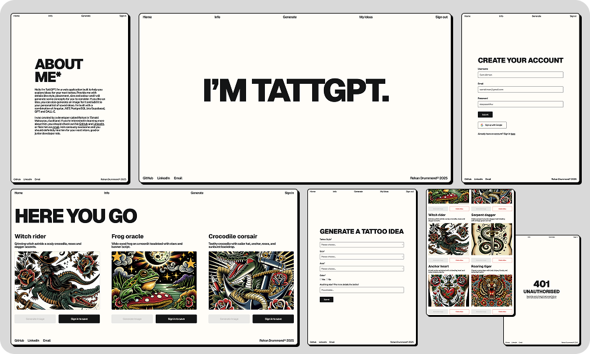
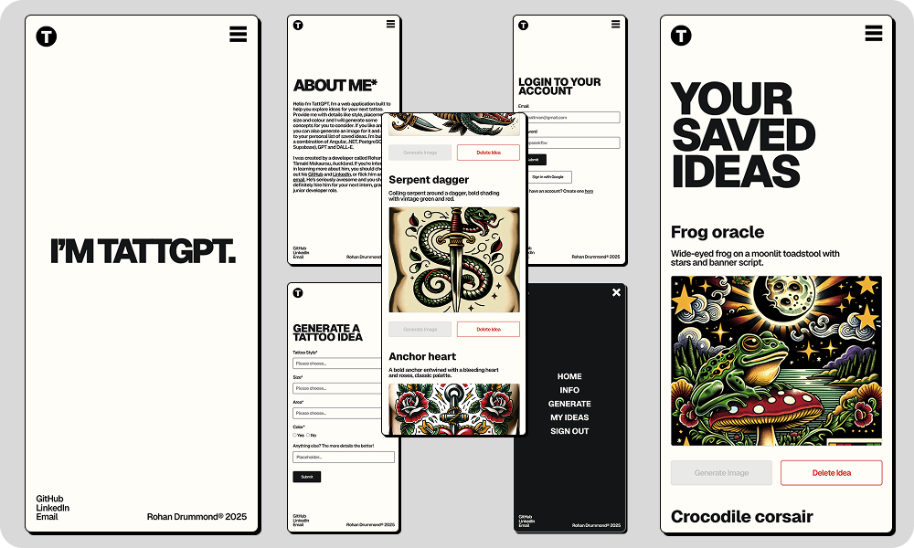

# TattGPT 🤖

Tattoo design generator built with Angular, .NET, OpenAI and Supabase (PostgreSQL)

TattGPT is a web application that generates unique tattoo ideas and designs based on user preferences like style, size and placement. Concepts are generated using Open AI's GPT-5 Mini model, and images are generated using the DALL·E 3. 

I’m planning on deploying this in the future, but for now I’m focused on completing my other projects and finishing my studies at Dev Academy Aotearoa.

## Tech Stack 👷

- __Frontend__: Angular
- __API__: .NET
- __Database__: Supabase (PostgreSQL)
- __AI Models__: OpenAI GPT-5 Mini and DALL·E 3

## Features 🚀

__Frontend__
- Custom text animation using recursive functions
- Client-side authentication with Supabase incl. Google OAuth
- Idea generation form that captures user tattoo preferences (Angular Reactive Forms)
- Dynamic results page based on structured JSON data from .NET API
- Ability to save a personal collection of designs
- 404 (Not Found) and 401 (Unauthorized) error handling
- Mobile-friendly design with full-screen menu

__Backend__
- .NET API provides endpoints for generating ideas (GPT-5 Mini) and images (DALL·E 3) via calls to the OpenAI API
- Additional endpoints provided for saving, deleting and updating ideas in Supabase (PostgreSQL)
- Minimal .NET Web API with separation of data structures in Models directory and OpenAI/Supabase logic in Services directory

## UI&nbsp; 🖼️

*Actual screenshots of web app, not from Figma

## License 👨‍⚖️

This project is open source under the MIT License.

## Contact 📫

Check out my other projects and contact info on my [GitHub](https://github.com/rohandrummond) profile.
