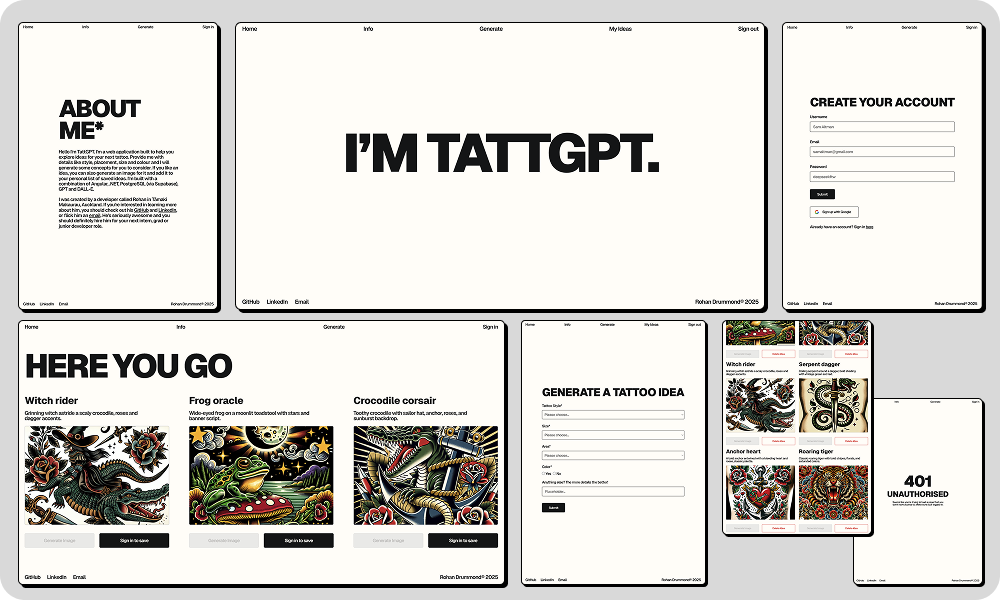

# TattGPT 🎨 


**About the project**

TattGPT is a tattoo design generator that creates concepts and images based on user preferences like style, size, placement, and themes. 

It's built with an Angular frontend, and a lightweight .NET web API for managing interactions with PostgreSQL (via Supabase) for storage and authentication, and OpenAI's GPT and DALL·E 3 models for text and image generation.

**Why I built it**

Prior to building this, I had primarly worked with vanilla JavaScript and React. I built TattGPT to challenge myself with something more complex by way of Angular and .NET, while also building something that was fun and useful to me.

Another thing I wanted to explore was how to integrate AI into a full stack application using APIs, particularly image generation via the DALL·E 3 model, something I hadn't worked with before.

It was great learning experience, and it taught me a lot about TypeScript and the value of working with structured data.

## Key features 💡 

**Angular Frontend**

- Reactive form with validation for capturing tattoo preferences
- Reusable nav, footer, and auth form components
- RxJS for managing authentication state and idea collections
- Custom recursive typing animation on home page
- Route guards and auth redirect service to protect pages and preserve navigation flow

**.NET API**

- Minimal Web API with dependency injection for OpenAI and Supabase services
- Strongly typed models for deserialising frontend requests
- Dedicated service layer for storing OpenAI and Supabase logic

**AI Integration**

- GPT generates 3 unique tattoo concepts per request with enforced JSON schema
- DALL·E 3 creates high resolution (1024x1024) tattoo images returned as base64
- Dynamic prompt construction based on user preferences (style, color, size, placement, themes)

**Authentication**

- Email/password and Google OAuth via Supabase Auth
- Session state managed through RxJS observables 
- Post login redirect to originally requested page

## Tech stack ⚙️

**Backend**

- .NET 
- PostgreSQL (via Supabase)
- OpenAI SDK (GPT, DALL·E 3)

**Frontend**

- Angular 
- Supabase Auth Client
- RxJS

## Screenshots ⚡️




## Getting Started 🚀 

**Prerequisites**

- .NET 9 SDK
- Node.js 18+
- npm
- OpenAI API key
- Supabase project (URL and anon key)

**Clone the repository**

```bash
git clone https://github.com/rohandrummond/tattgpt.git
cd tattgpt
```

**Set up environment variables**

Backend requires these environment variables:

```bash
export TATTGPT_API_KEY=your_openai_api_key
export SUPABASE_URL=your_supabase_url
export SUPABASE_KEY=your_supabase_anon_key
```

Frontend uses `client/angular/src/environments/environment.ts` for Supabase credentials.

**Run the backend**

```bash
cd server/dotnet
dotnet build
dotnet run --launch-profile https
```

The API runs on `https://localhost:7072`.

**Run the frontend**

In a new terminal from the project root:

```bash
cd client/angular
npm install
npm start
```

The app runs on `http://localhost:4200`.
